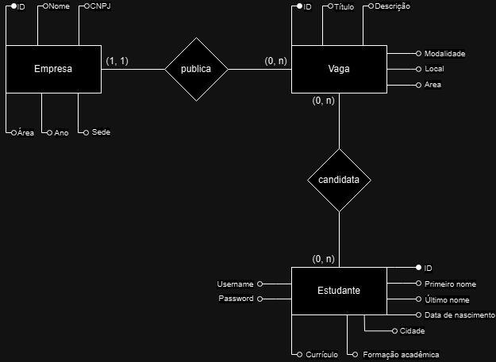

<h1 align="center">
    
    <p style="font-size: 15px;">
    O caminho de oportunidades para estudantes da área da tecnologia da informação.
    </p>
</h1>


<p align="center">
    
</p>

## 📌 Descrição do projeto
`SÓ TI ESTÁGIOS` é uma plataforma de <label style="font-weight: bold;">“Gerenciamento de Estágios - Divulgação e Controle”</label> feita para estudantes de graduação em áreas da tecnologia, como Sistemas de Informação, Ciência da Computação e similares.

Essa plataforma terá o objetivo de ser um local onde estudantes possam encontrar oportunidades de estágio para complementarem sua graduação. Além disso, empresas também podem cadastrar e divulgar suas oportunidades de emprego.

### ▶ Modelo Entidade Relacionamento


## ✨ Funcionalidades 
### ◽Estudante
- `Perfil`: Estudantes podem realizar um cadastro na plataforma e ter um perfil com suas informações pessoais, educacionais e profissionais.
- `Busca por vagas`: Realização de busca de vagas através da barra de pesquisa, ou por áreas específicas.
- `Candidatura`: Permite a candidatura do estudante em vagas encontradas na plataforma.

### ◽Empresa
- `Perfil`: Empresas podem realizar um cadastro na plataforma e ter um perfil com suas informações.
- `Publicação de vagas`: Permite publicação de vagas na plataforma.
- `Acompanhamento de vagas`: A empresa pode acompanhar as candidaturas de estudantes na vaga.


## 🛠️ Tecnologias usadas
- `Spring Boot`
- `React`
- `HTML`
- `CSS`
- `Bootstrap`

## 🗂️ Como rodar o projeto
```bash
    #Run Spring Boot aplication
    $ cd sotiestagios/src
    $ mvn clean install
    $ mvn spring-boot:run
```
Caso a menira acima não funcione, navegue manualmente até o diretório `sotiestagios/src/main/java/matsa/application/backend` e execute o arquivo `SoTiEstagiosApplication.java` através da interface de sua IDE.

```bash
    #Run React aplication
    $ cd sotiestagios/frontend
    $ npm start

```